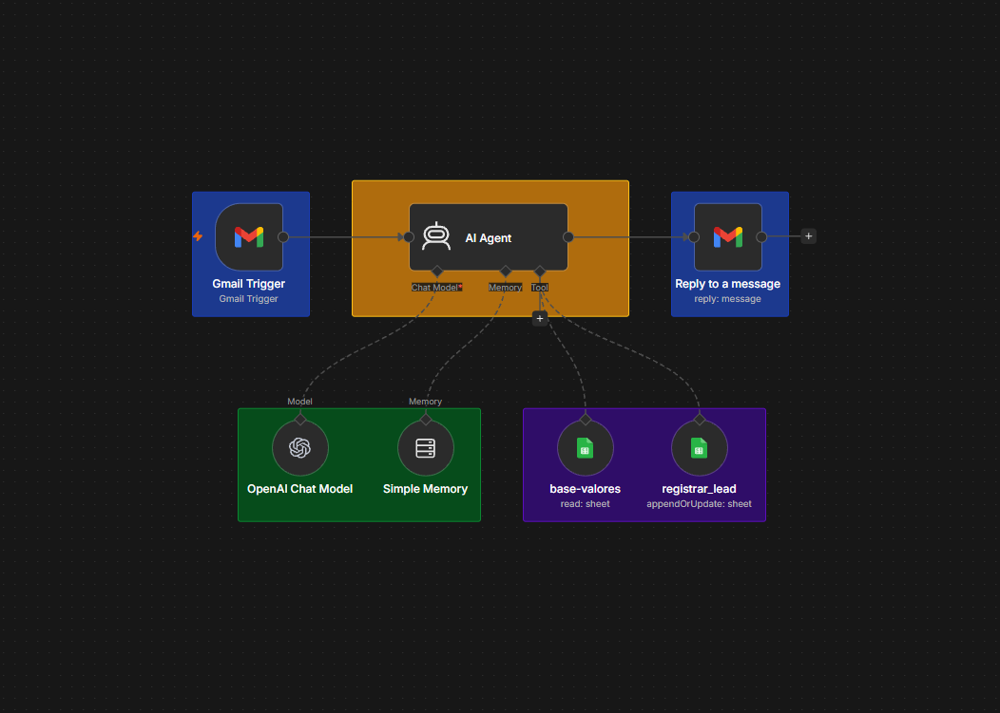
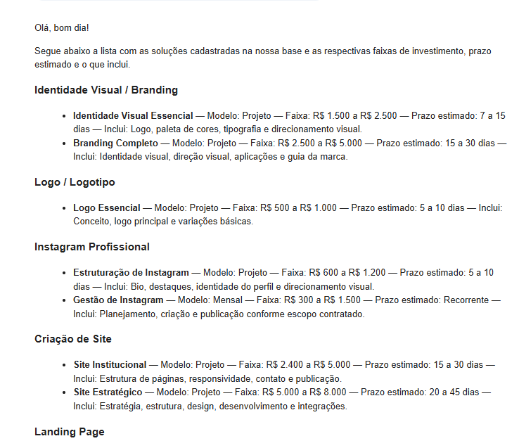
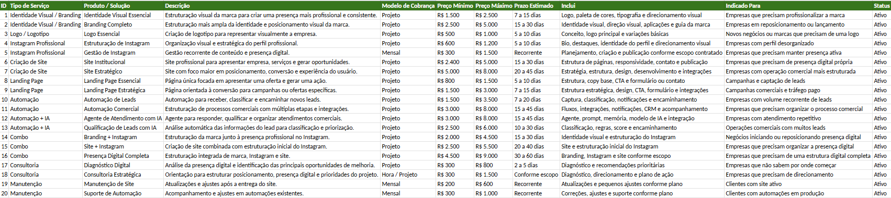
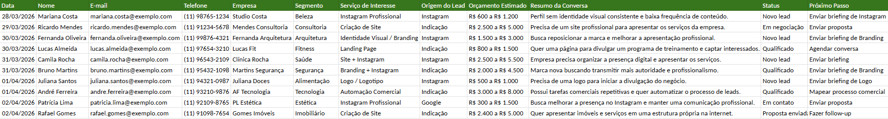

# ORVIAN — AI Commercial Assistant

### Atendimento, qualificação e organização automática de leads com n8n e IA

**Gmail → AI Agent → Chat Model + Memory + Google Sheets → Gmail**

*Um assistente comercial criado para transformar mensagens recebidas em atendimentos contextualizados e oportunidades comerciais organizadas.*

---

## 📸 Visão do Workflow



> **ORVIAN** utiliza uma arquitetura baseada em agente de IA: o lead entra pelo e-mail, o agente interpreta a mensagem, consulta informações comerciais quando necessário, registra a oportunidade e responde ao cliente.

---

## ⚙️ Workflow n8n

O workflow completo pode ser exportado diretamente do n8n para consulta e reutilização.

```text
Gmail Trigger
      │
      ▼
   AI Agent
   ├── Chat Model
   ├── Simple Memory
   ├── base-valores
   └── registrar_lead
      │
      ▼
Reply to a message
```

> **Nota:** configure suas próprias credenciais do Gmail, do modelo de IA e das planilhas antes de executar.

---

## ✉️ Experiência do Lead

Além da automação interna, o projeto foi desenvolvido para interpretar o contexto de cada mensagem e gerar uma resposta de acordo com a necessidade apresentada.

### Exemplo de resposta



> O agente utiliza o contexto da conversa e as informações comerciais disponíveis para construir a resposta ao potencial cliente.

---

## 🎯 Sobre o Projeto

Este projeto é um assistente comercial inteligente desenvolvido para a **ORVIAN**, com o objetivo de automatizar parte do primeiro atendimento de potenciais clientes.

O agente consegue:

- interpretar a mensagem recebida;
- entender o contexto do negócio;
- identificar a necessidade;
- consultar a base comercial;
- apresentar informações de serviços;
- coletar informações para briefing;
- identificar interesse comercial;
- registrar ou atualizar o lead;
- conduzir o cliente para o próximo passo.

A proposta é transformar o primeiro contato em uma etapa estruturada do processo comercial.

---

## 🧩 Arquitetura

```text
┌─────────────────────────┐
│         Gmail           │
│    Entrada do Lead      │
└────────────┬────────────┘
             │
             ▼
┌─────────────────────────┐
│       AI Agent          │
│ Interpretação e decisão │
└───────┬───────┬─────────┘
        │       │
        ▼       ▼
┌─────────────┐ ┌────────────────┐
│Simple Memory│ │  base-valores  │
│   Contexto  │ │ Base comercial │
└─────────────┘ └────────────────┘
        │
        ▼
┌────────────────────────┐
│    registrar_lead      │
│ Base de prospecção     │
└────────────┬───────────┘
             │
             ▼
┌─────────────────────────┐
│   Reply to a message    │
│      Gmail / Cliente    │
└─────────────────────────┘
```

---

## ⚙️ Como funciona

### 01 — Recepção

O potencial cliente envia uma mensagem para o endereço monitorado pela ORVIAN.

### 02 — Trigger

O **Gmail Trigger** detecta a nova mensagem.

Configuração utilizada:

- **Event:** Message Received
- **Polling:** Every Minute
- **Max Emails per Poll:** 10

### 03 — Interpretação

O **AI Agent** interpreta:

- intenção;
- contexto;
- necessidade;
- serviço relacionado;
- informações já fornecidas;
- possível interesse comercial.

### 04 — Consulta comercial

Quando a mensagem exige preço, prazo ou escopo, o agente consulta:

```text
base-valores
```

### 05 — Qualificação

Quando existe interesse comercial real, o agente organiza as informações do contato e avalia o estágio da oportunidade.

### 06 — Registro

A ferramenta:

```text
registrar_lead
```

cria ou atualiza o registro do lead.

### 07 — Resposta

O agente gera a resposta e o workflow envia a mensagem pelo Gmail.

---

## 🧠 Inteligência Comercial

O agente não foi configurado apenas para responder perguntas.

```text
Mensagem
   ↓
Entender contexto
   ↓
Identificar necessidade
   ↓
Consultar base
   ↓
Esclarecer dúvidas
   ↓
Coletar informações
   ↓
Identificar interesse
   ↓
Registrar / atualizar lead
   ↓
Próximo passo
```

> **Primeiro entender o problema. Depois relacionar a necessidade à solução adequada.**

---

## 🗂️ As duas bases do projeto

O projeto utiliza **duas bases diferentes**, cada uma com uma função específica.

Essa separação é importante porque uma base guarda o **conhecimento comercial da ORVIAN**, enquanto a outra guarda as **informações dos leads e o histórico do atendimento**.

```text
💰 BASE LEADS 1
Base Comercial
      ↓
Serviços • Valores • Prazos • Escopo • Status


👤 BASE LEADS 2
Base de Prospecção
      ↓
Cliente • Empresa • Necessidade • Conversa • Status • Próximo passo
```

---

## 💰 Base Leads 1 — Base Comercial

A **Base Leads 1** funciona como o catálogo comercial interno da ORVIAN.

Nela ficam cadastrados os **serviços e soluções oferecidos pela empresa**, juntamente com informações como:

- descrição do serviço;
- modelo de cobrança;
- faixa de investimento;
- prazo estimado;
- o que está incluído;
- para qual tipo de empresa a solução é indicada;
- status do serviço.

O campo **Status** permite identificar se determinado serviço está atualmente **ativo** e disponível para comercialização.

> **Importante:** os valores presentes nessa base são **fictícios** e utilizados apenas para demonstração do projeto.

Quando um cliente pergunta sobre determinado serviço, a IA pode consultar essa base para encontrar as informações correspondentes e utilizar esses dados durante o atendimento.

### Em resumo

```text
Base Comercial
      ↓
Serviços
      ↓
Valores
      ↓
Prazos
      ↓
Escopo
      ↓
Status
      ↓
IA consulta quando necessário
```

### 📸 Base Comercial



> A imagem acima representa a estrutura utilizada para organizar os serviços, valores, prazos, escopo e status dos produtos.

---

## 👤 Base Leads 2 — Gestão e Histórico dos Leads

A **Base Leads 2** é responsável por armazenar e organizar as informações dos potenciais clientes que entram em contato com a ORVIAN.

Durante o atendimento, a IA coleta informações relevantes, como:

- nome;
- empresa;
- segmento;
- serviço de interesse;
- orçamento;
- resumo da conversa;
- status comercial;
- próximo passo.

Além disso, o agente utiliza o **Simple Memory** para manter temporariamente o contexto da conversa.

Dessa forma, quando o cliente enviar uma nova mensagem, o atendimento pode **continuar a partir do ponto em que a conversa anterior parou**, evitando que o cliente precise repetir todas as informações novamente.

### Em resumo

```text
Cliente entra em contato
        ↓
IA entende a conversa
        ↓
Informações são organizadas
        ↓
Histórico é mantido temporariamente
        ↓
Próximo contato continua de onde parou
```

### 📋 Estrutura da Base Leads 2

| Campo | Função |
|---|---|
| Data | Data da interação |
| Nome | Nome do contato |
| E-mail | E-mail do lead |
| Telefone | Telefone |
| Empresa | Empresa |
| Segmento | Segmento do negócio |
| Serviço de Interesse | Serviço identificado |
| Origem do Lead | Origem conhecida |
| Orçamento Estimado | Valor informado pelo cliente |
| Resumo da Conversa | Contexto comercial |
| Status | Estágio atual do lead |
| Próximo Passo | Ação comercial seguinte |

### 📸 Base de Leads



> A base organiza os contatos e mantém as principais informações necessárias para acompanhar cada oportunidade comercial.

### 🔄 Não duplicação

Antes de criar um novo registro, o agente deve verificar:

```text
E-mail
  ↓
Telefone
  ↓
Nome + Empresa
```

Se o lead já existir, o registro deve ser atualizado em vez de criar uma nova linha.

---

## 🔗 Como as duas bases trabalham juntas

As duas bases possuem funções diferentes, mas trabalham em conjunto durante o atendimento.

```text
                CLIENTE
                   ↓
              AI AGENT
               ↙     ↘
              ↓       ↓
      BASE LEADS 1   BASE LEADS 2
       Comercial       Prospecção
          ↓               ↓
   O que vendemos    Quem está interessado
   Quanto custa      O que precisa
   Prazo             Histórico
   Escopo            Status
   Status            Próximo passo
              ↘     ↙
               ↓
             RESPOSTA
```

### Regra simples

> **Base Leads 1 responde "o que a ORVIAN oferece?"**

> **Base Leads 2 responde "quem é o lead e em que ponto do atendimento ele está?"**

Essa separação torna o fluxo mais organizado, facilita a manutenção das informações e permite que a IA utilize cada fonte para a finalidade correta.

---

---

## 📊 Status Comercial

- **Novo lead**
- **Em contato**
- **Qualificado**
- **Proposta enviada**
- **Em negociação**
- **Fechado**
- **Perdido**

O status deve representar o estágio comercial mais recente conhecido.

---

## 📝 Briefing Inteligente

O agente pode coletar progressivamente:

- Nome;
- Empresa;
- Segmento;
- Serviço de interesse;
- Objetivo;
- Principal problema;
- Público-alvo;
- Referências;
- Materiais disponíveis;
- Prazo desejado;
- Orçamento estimado.

As perguntas são feitas conforme o contexto, evitando transformar o atendimento em um formulário artificial.

---

## 🎨 Personalização por Serviço

### Branding / Identidade Visual

História, personalidade, público, posicionamento, referências e identidade atual.

### Instagram

Ramo, objetivo, público, referências, materiais e frequência.

### Site

Objetivo, serviços, estrutura, público, referências e materiais.

### Landing Page

Objetivo, oferta, público, campanha, CTA e captação.

### Automação

Processo atual, tarefas repetitivas, ferramentas, volume, gargalos e resultado esperado.

---

## 💬 Tom de Voz

A comunicação deve ser:

- profissional;
- próxima;
- humana;
- clara;
- objetiva;
- consultiva;
- acolhedora.

### Posicionamento

> **MARCAS QUE GERAM RESULTADOS**

### Direcionamento

> **Estratégia • Criação • Resultados**

---

## ✉️ Formatação das Respostas

O prompt orienta o agente a gerar conteúdo em HTML simples.

### Regras

- HTML válido;
- sem Markdown;
- sem blocos de código;
- sem `<html>`, `<head>` ou `<body>`;
- sem JavaScript;
- sem informações inventadas;
- parágrafos curtos;
- personalização quando houver dados.

A IA é responsável pelo **conteúdo**. O layout visual pode ser controlado separadamente pelo template do e-mail.

---

## 🧠 Simple Memory

O **Simple Memory** fornece contexto conversacional ao AI Agent, permitindo considerar informações já presentes no atendimento.

---

## 🚨 Tratamento de Exceções

Quando o agente não encontra uma solução, preço ou prazo na base, ele não deve inventar informações.

Também deve solicitar esclarecimentos quando houver dúvida entre soluções.

---

## 🧪 Testes

### 01 — Pergunta institucional

```text
O que vocês fazem?
```

Esperado: resposta institucional sem criação desnecessária de lead.

### 02 — Pergunta comercial

```text
Quanto custa um site?
```

Esperado:

```text
Cliente → AI Agent → base-valores → Resposta
```

### 03 — Interesse em projeto

```text
Tenho uma empresa de consultoria e quero criar um site profissional.
```

Esperado: entender contexto, qualificar e registrar/atualizar o lead.

### 04 — Lead existente

Esperado: atualizar o registro existente, sem duplicar.

### 05 — Serviço não encontrado

Esperado: não inventar preço ou prazo e encaminhar para avaliação.

---

## 🛠️ Tecnologias

| Tecnologia | Utilização |
|---|---|
| **n8n** | Orquestração |
| **Gmail** | Entrada e saída |
| **AI Agent** | Inteligência |
| **Chat Model** | Processamento de linguagem |
| **Simple Memory** | Contexto |
| **Google Sheets** | Bases comerciais |
| **HTML** | Respostas |

---

## 📁 Estrutura do Projeto

```text
orvian-ai-commercial-assistant/
│
├── README.md
│
├── docs/
│   ├── workflow-ai-agent.png
│   ├── ai-response-example.png
│   └── AI-AGENT-PROMPT.md
│
└── workflow/
    └── orvian-ai-commercial-assistant.json
```

O JSON deve ser exportado diretamente do n8n e sanitizado antes da publicação.

---

## 🚀 Como Executar

### 1. Gmail

Conecte a conta que receberá os contatos.

### 2. Chat Model

Configure uma credencial válida do modelo escolhido.

### 3. AI Agent

Configure:

- System Message;
- User Message;
- Chat Model;
- Simple Memory;
- `base-valores`;
- `registrar_lead`.

### 4. Google Sheets

Configure as bases comercial e de prospecção.

### 5. Reply to a message

Conecte a saída do AI Agent ao Gmail.

### 6. Ativar e testar

Envie novas mensagens e valide cada etapa da execução.

---

## 🧪 Problemas Encontrados

### Modelo Gemini indisponível

Durante o desenvolvimento, o modelo Gemini utilizado apresentou erros `503 Service Unavailable`. O problema estava relacionado à disponibilidade do serviço do modelo. O fluxo foi validado utilizando outro Chat Model.

### Conteúdo da ferramenta retornado diretamente

Em um teste, informações da `base-valores` apareceram diretamente na resposta. Isso levou à separação explícita entre:

```text
Ferramenta
   ↓
Informação interna
   ↓
Interpretação do AI Agent
   ↓
Resposta ao cliente
```

### Separação entre conteúdo e apresentação

A arquitetura permite manter:

```text
AI Agent → Conteúdo
Template → Apresentação visual
```

---

## 🔐 Segurança

Nunca versionar:

```text
.env
credentials.json
API Keys
tokens
senhas
credenciais do n8n
dados reais de clientes
conteúdo sensível de conversas
```

Antes de publicar o workflow no GitHub, remova credenciais e informações privadas.

---

## 📈 Próximas Evoluções

- CRM integrado;
- Dashboard comercial;
- Lead scoring;
- Follow-up automático;
- WhatsApp;
- Calendário;
- Briefing automático;
- Geração de propostas;
- Notificação interna;
- Histórico de interações;
- Roteamento para atendimento humano;
- Métricas de conversão.

---

## 💼 Objetivo de Negócio

O objetivo não é apenas automatizar respostas.

A solução foi construída para:

- reduzir tarefas repetitivas;
- acelerar o primeiro atendimento;
- organizar informações;
- personalizar a comunicação;
- evitar perda de oportunidades;
- manter histórico;
- estruturar o processo comercial.

### Princípio

> **Automatizar o operacional para liberar tempo para o estratégico.**

---

## 👨‍💻 Projeto

**ORVIAN — Branding • Sites • Instagram • Automação • IA**

Assistente comercial desenvolvido como parte da estrutura de automação e processos digitais da ORVIAN.
